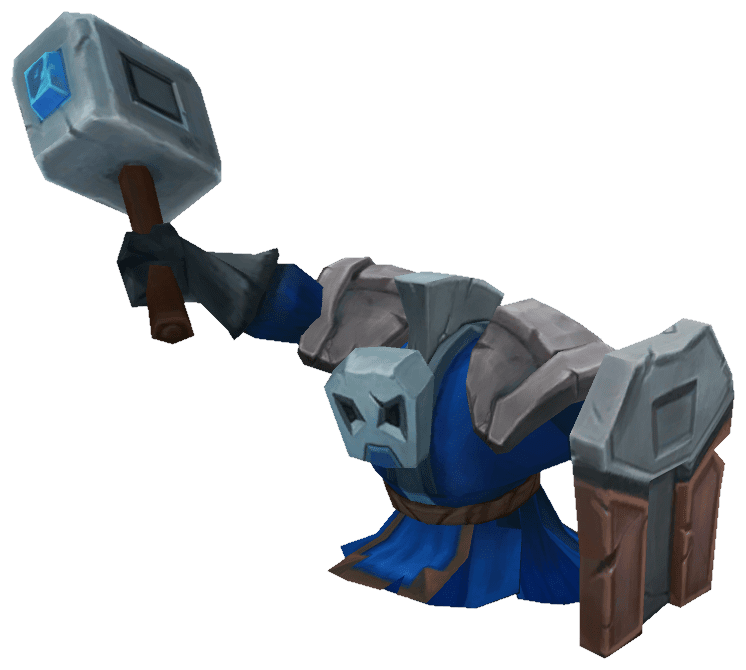

# LEAGUE OF LEGENDS


La mia analisi sarà fatta su un videogioco chiamato league of legends, l'ho fatto perchè ci gioco praticamente ogni giorno, mi piace giocarci e si possono ricavare tanti dati interessanti.

Ma prima di iniziare a vedere l'analisi devo spiegare che cos'è league of legends.

League of legends ("lol" abbreviato) è un gioco in cui si gioca 5vs5 su una mappa e l'obiettivo è distruggere la base nemica.


## CAMPIONI

In questo gioco possiamo scegliere più di 150 personaggi (campioni) differenti.


### Le domande che mi sono posto sono per fare questa analisi sono:

Qual è la percentuale di vittorie e sconfitte sulle partite totali?

Con quali campioni vinco di più?

Quanto influisco nella partita?

Quante partite vinco al giorno rispetto al totale della giornata?

Com'è l'andamento degli "lp"?


## DATASET

```{r setup, include=FALSE}
knitr::opts_chunk$set(echo = TRUE)
setwd("C:/Users/Michele/Desktop/Scuola/Università/Esame Scienza dei dati/datasets")
library(tinytex)
library(tibble)
library(tidyr)
library("dplyr")
library("readr")
library(tidyverse)
library("readxl")
library(ggplot2)
library(modelr)
library(ggrepel)
personale <- read_excel("Personale.xlsx")
partita <- read_excel("partita.xlsx")
partitaAvv <- read_excel("partitaAvv.xlsx")
```


## WIN RATE

Il win rate totale di tutte le partite:

```{r WinRate, echo=FALSE, comment=NA}
WinRateTot = partita %>%
              group_by(Risultato) %>%
                summarise(n = n()) %>%
                  mutate(WinRate = n/sum(n)*100)
WinRateTot
```

## Win Rate Campioni

Qui possiavo vedere i campioni più usati e il win rate con ognuno di essi:

```{r CampioniUsati, echo=FALSE, comment=NA}
CampUsati = personale %>% 
              group_by(Campione) %>% 
                count() %>%
                  filter(n>5)
ggplot(CampUsati, aes(reorder(x=Campione, -n), y=n, fill = Campione)) +
  geom_col() + 
    ggtitle("Campioni più usati") + 
      labs(y = "", x = "Campioni") 
```

```{r WinRatecampioni, echo=FALSE, comment=NA}
k <- personale[,c("ID", "Campione")] 
g <- partita[,c("ID", "Risultato")]
WinRateCamp = merge(k,g, by="ID", all=FALSE) 
WinRateCamp = WinRateCamp %>% 
                group_by(Campione, Risultato) %>%
                  summarise(n = n()) %>%
                    mutate(WinRate = n/sum(n))
WinRateCamp = filter(WinRateCamp, Risultato=="V" & WinRate<0.75 & WinRate>0.25) 
ggplot(WinRateCamp, aes(reorder(Campione,-WinRate), y = WinRate, fill = Campione)) +  
  geom_col() + 
    ggtitle("Win Rate Campioni") + 
      labs(y = "Win rate", x = "Campioni") +
        scale_y_continuous(labels = scales::percent) +
          scale_x_discrete(guide = guide_axis(n.dodge=2)) +
            scale_fill_manual(values = c("darkgoldenrod", "grey", "lightgreen", "gold", "red", "lightblue", "chocolate4", "brown", "darkgreen", "green"))
```

## CS al minuto

```{r CS, echo=FALSE, comment=NA}
Cs1 <- partita[,c("ID", "Durata")]
Cs2 <- personale[,c("ID", "Cs")]
CS = merge(Cs1, Cs2, by="ID", all=FALSE)
CS$Cs_m = personale$Cs/partita$Durata
ggplot(CS, aes(x=1, y=Cs_m)) +
    geom_boxplot(fill="lightblue")+
      labs(x="", y = "Cs/m") +
        ggtitle("Grafico Cs/m")
```



## Kill Participation

La kill participation determina quanto sono stato influente nella partita

```{r KillParticipation, echo=FALSE, comment=NA}
t <- partita[,c("ID", "Uccisioni")]
colnames(t)[2] = "UccisioniTeam"
j <- personale[,c("ID", "Uccisioni", "Assist")] 
colnames(j)[2] = "UccisioniPers"
colnames(j)[3] = "AssistPers"
KillPart = merge(t,j, by="ID", all=FALSE) 
KillPart = cbind(KillPart, (KillPart$UccisioniPers+KillPart$AssistPers) / KillPart$UccisioniTeam)
colnames(KillPart)[5] = "KillParticipation"
#View(KillPart)
ggplot(KillPart, aes(1:nrow(personale),KillParticipation, color="red")) +
    geom_point() +
      geom_smooth(color="blue", se = FALSE) +
        ggtitle("Grafico Kill partecipation") + 
          labs(y = "Kill partecipation", x = "Partite") +
            scale_y_continuous(labels = scales::percent)
```

## Andamento di una giornata

```{r Giorni, echo=FALSE, comment=NA}
giorni = partita %>%
          group_by(Data, Risultato) %>%
            summarise(Vittore_Sconfitte = n()) %>%
              mutate(Giornaliere = Vittore_Sconfitte/sum(Vittore_Sconfitte) * 100)
giorni = filter(giorni, Risultato == "V")
giorni
ggplot(giorni, aes(x=Vittore_Sconfitte, y=Data, fill=Giornaliere)) + 
    geom_tile(color="black", width=0.9) +
      scale_fill_continuous(low="red",
                            high="green",
                            name= "Percentuale delle vittore\nsulle partite totali") +
        labs(x = "Vittorie al giorno") +
        ggtitle("Percentuale vittorie in 1 giorno")
```

## **Confronto Oro**

Confronto l'oro ottenuto dalla mia squadra con l'oro dell'altra squadra

```{r Oro, echo=FALSE, comment=NA}
OroSquadMia = partita[,c("ID", "Risultato", "Gold")]
OroSquadAvv = partitaAvv[,c("ID", "Gold")] 
colnames(OroSquadAvv)[2] = "GoldAvv"
Oro = merge(OroSquadMia,OroSquadAvv, by="ID", all=FALSE) 
Oro$TipoDiVittoria = ifelse((Oro$Gold>Oro$GoldAvv & Oro$Risultato == "V"), "Vittoria Oro>Avversario", 
                            ifelse((Oro$Gold<Oro$GoldAvv & Oro$Risultato == "V"), "Vittoria Oro<Avversario", 
                                   ifelse((Oro$Gold>Oro$GoldAvv & Oro$Risultato == "F"), "Sconfitta Oro>Avversario", "Sconfitta Oro<Avversario")))
Confronto = Oro %>% 
              group_by(TipoDiVittoria) %>% 
                summarise(n = n()) %>%
                  mutate(Percentuale = n/sum(n)*100)
Confronto
ggplot(Oro, aes(x=Risultato, y=Gold, fill=Risultato))+
  geom_boxplot() +
    scale_fill_manual(values = c("red", "seagreen3")) +
      labs(y = "Oro Squadra", x = "Vittorie/Sconfitte") +
        ggtitle("Confronto oro tra le vittorie e le sconfitte")

```

## **LP 1**

Andamento degli LP nell'arco delle partite

```{r Lp, echo=FALSE, comment=NA}
lp <- personale[,c("ID", "LP.Totali", "LP.Partita")]
Barre <- data.frame(start = c(-137, -37, 63, 163),  # Create data with breaks
                          end = c(-37, 63, 163, 263),
                          ranks = factor(4:1))
ggplot() +                           
  geom_rect(data = Barre,
            aes(ymin = start,
                ymax = end,
                xmin = - Inf,
                xmax = Inf,
                fill = ranks),
            alpha = 0.3) +
            geom_line(data = lp,
                       aes(x = 1:nrow(personale),
                           y = LP.Totali)) +
                                        labs(y = "LP", x = "Partite") +
                                          ggtitle("Grafico LP") +
                                            scale_fill_discrete(labels = c("Silver 4", "Silver 3", "Silver 2", "Silver 1"))
```

## **LP 2**

Osserviamo gli lp persi e guadagnati in 2 parti del grafico

```{r Lp2, echo=FALSE, comment=NA}
print(lp[56:65,3])
print(lp[94:102,3])
```

## **CONCLUSIONI**

Miglioramenti nella seconda parte delle partite prese in esame

Se hai più oroo dell'altra squadra è molto probabile che tu vinca

Più si gioca con un campione più il win rate si va a stabilizzare tra il 40% e 60%
